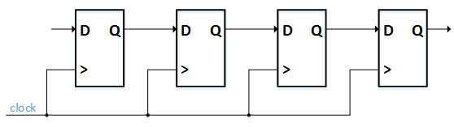

##############
Shift Register
##############

Shift registers are a common FPGA building block. They are created by cascading :ref:`Flip-Flops <FF>` (Registers) in
a chain. All registers must share the same clock, and the output of one register must be connected to the input of the 
next register in the chain. Shift registers are mainly used to accomplish one of three goals:

1. Delaying data by some number of clock cycles
#. Converting serial data to parallel data
#. Converting parallel data to serial data

====================================
Creating a Shift Register for Delay
====================================

Creating delay in an FPGA is the most common use of a shift register. The delay is often used to align data in time. 
The figure below shows this simple type of shift register. The number of Flip-Flops in the delay chain dictates how
many clock cycles it will take for the data on the input to propagate to the data on the output. So in the picture 
below, it will take four clock cycles for an input on D on the first Flip-Flop to be seen on the output Q of the last 
Flip-Flop. Read about Processes in VHDL or Always Blocks in Verilog for a tutorial on how to create a shift register 
in your HDL of choice.

    Shift Register - From D Flip-Flops.

========================================
Converting serial data to parallel data
========================================

Converting from serial data to parallel data is another common use of shift registers. This occurs when interfacing 
to off-chip signals that transmit data serially such as a UART Receiver. When data comes in over a UART, it need to be
converted from serial data 1-bit wide to a parallel byte that the FPGA can look at.

========================================
Converting parallel data to serial data
========================================

This is the opposite of the above and is used in UART Transmitter. When you want to transmit a byte over UART, it must
first be serialized and sent out over the single UART line. A shift register can be used for this purpose.

.. TODO: RTL examples
