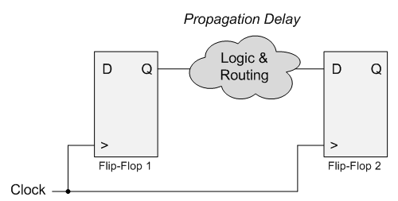
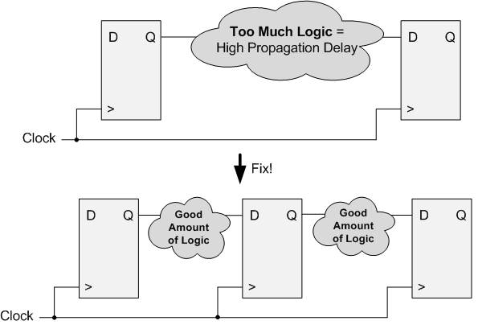

.. _Delay:

#################
Propagation Delay
#################

Propagation Delay is the amount of time it takes for a signal to travel from a source to a destination. Propagation
Delay is a fundamental concept of how digital circuits work. It is also a very good subject to understand because 
interviewers love to ask about Propagation Delay. Now clearly not all signals travel instantaneously. It takes some 
very small amount of time for voltage changes to propagate down a wire. The rule of thumb is that `signals can travel
roughly 30 cm or one foot of wire in one nanosecond 
<http://en.wikipedia.org/wiki/List_of_unusual_units_of_measurement#Light-nanosecond>`_.

Inside of your FPGA or ASIC there are thousands of tiny wires running everywhere. When you actually add up the
physical length of the wires, they can easily be over a foot long, which is pretty amazing considering how small the
chips are. Additionally, every piece of logic that your code goes through takes some finite delay time. Since these
delays do exist, the digital designer needs to understand how they impact the FPGA or ASIC.

    Propagation Delay Between two Flip-Flops
    
**Propagation delay is fundamentally important to sequential logic.** Again, sequential logic is logic that is driven 
by a clock. In the Figure above, there are two :ref:`Flip-Flops <FF>` that are connected together with some logic and 
routing (wires) between them. The amount of time it takes for the output of the first Flip-Flop to travel to the input
of the second Flip-Flop is the Propagation Delay. The further apart those two Flip-Flops are or the more combinational
logic in the middle, the longer the propagation delay between the two of them. **The longer the propagation delay, the 
slower your clock is able to run.**

The reason for this is that both Flip-Flops use the same clock. The first Flip-Flop drives its output at clock edge 1.
The second Flip-Flop does not see the change on the output of the first Flip-Flop until clock edge 2, at which point 
it drives its output. If the signal can safely travel from Flip-Flop 1 to Flip-Flop 2 in one clock period, your design
is good! If not, you will run into problems.

For example, consider the case where you have two Flip-Flops that are 10 nanoseconds (ns) apart from each other. If
you use a clock that runs at 50 MHz (20 ns period) you will be safe. You have 10 ns to spare. However if you use a
200 MHz clock (5 ns period) your design will fail timing analysis and not work the way you expect.

The purpose of any timing analyzer in your FPGA or ASIC tools is to tell you if you have problems meeting timing. If 
your design is too slow to run at the clock frequency you want, you will get timing errors and your design will likely
not work correctly.

================================================
Fixing high propagation delay:
================================================

1. Slow down your clock frequency
2. Break your logic up into stages (pipeline)

Slowing down your clock frequency is the most obvious thing. If you are able to run your FPGA slower, your timing will
improve. Breaking up your logic into stages is the more robust solution. If you do less "stuff" between two 
Flip-Flops, the propagation delay will decrease and your design will meet timing.

    How to pipeline your design to fix timing errors.
    
In the figure above, there is a large amount of logic between two Flip-Flops. So much so that the design has too large
of a propagation delay and fails timing. If the designer breaks up the logic between three Flip-Flops, half of the 
logic can be done between the first two Flip-Flops and the other half of the logic can be done between the second two.
Now the tools will have almost twice as much time to do what you need in a single clock cycle. This is called
pipelining and it is very important to being a good Digital Designer. When you design your code in a pipeline it will
have a much better chance at meeting timing at high clock frequencies.
