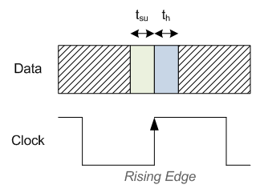

.. _SetupHold:

###################
Setup and Hold Time
###################

Setup time and Hold time are important concepts to understand for every digital designer. This article explains what 
setup and hold times are and how they are used inside of an FPGA. This article assumes that the reader has at least a
basic understanding of what a :ref:`Flip-Flop <FF>` is and how :ref:`propagation delay <Delay>` affects designs.

    
    Setup and Hold Time

As a refresher, propagation delay is the amount of time it takes for signals to pass between two Flip-Flops. As a
signal travels down a wire, it can change from a 0->1 or 1->0. An input to a Flip-Flop needs to be stable (not
changing) in order for an FPGA design to work properly. The input must be stable for some small amount of time prior
to being sampled by the clock. This amount of time is called setup time. **Setup time is the amount of time required 
for the input to a Flip-Flop to be stable before a clock edge.** Hold time is similar to setup time, but it deals with
events after a clock edge occurs. **Hold time is the minimum amount of time required for the input to a Flip-Flop to 
be stable after a clock edge.**

In the figure, the green area represents the t\:sub:`su` or Setup Time. The blue area represents the th or Hold Time.
In these areas, the data into the Flip-Flop must be a stable 0 or a 1.

=========================================================================
Relation between Setup and Hold to Propagation Delay and Clock Frequency
=========================================================================

Setup time, hold time, and propagation delay all affect your FPGA design timing. The FPGA tools will check to make 
sure that your design meets timing, which means that the clock is not running faster than the logic allows. The 
minimum amount of time allowed for your FPGA clock (its Period, which is represented by T) can be calculated. From 
this you can find the clock's frequency, as frequency is the inverse of period (F=1/T). It is as follows: 

t\ :sub:`clk (min)` = t\ :sub:`su` + t\ :sub:`h` + t\ :sub:`p`

Generally in your FPGA design, t\ :sub:`su` and t\ :sub:`h` are fixed for your Flip-Flops, so the only variable that
you have control over is t\ :sub:`p` or the Propagation Delay. This delay represents how much stuff you're trying to
accomplish in one clock cycle. The more stuff you try to do, the longer t\ :sub:`p` will be, and the higher 
t\ :sub:`clk (min)` will be, which means that you will not be able to clock your FPGA design as quickly. This is the
fundamental trade-off of FPGA designs. You are trading off how much stuff you can do in one clock cycle for the
frequency of your clock. The two are inversely related.

==================================================
What Happens if Setup and Hold Times Are Violated?
==================================================

If your design has setup or hold time violations, the Flip-Flop output is not guaranteed to be stable. It could be 
zero, it could be one, it could be somewhere in the middle, it's not known. This is called 
:ref:`metastability <Meta>`. Metastability inside of an FPGA is not desirable, it can cause your FPGA to
behave strangely.

The main way that an FPGA designer finds out if they have violated setup or hold times is when running the FPGA 
through `Place and Route <https://en.wikipedia.org/wiki/Place_and_route>`_. Place and Route is what happens when you 
take your VHDL or Verilog code and put it onto an FPGA. As a part of this process, the FPGA tools will take your 
design and run a timing analysis. It is in this timing analysis that you will see any timing errors, which are really 
just setup or hold time violations. How to fix these errors is beyond the scope of this article, but read the article
on Propagation Delay to see how these timing errors can be fixed.
