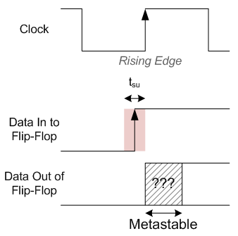
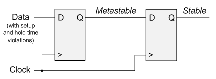

.. _Meta:

#############
Metastability
#############

If you have ever tried to sample some input to your FPGA, such as a button press, or if you have had to cross clock
domains, you have had to deal with Metastability. A metastable state is one in which the output of a Flip-Flop inside
of your FPGA is unknown, or non-deterministic. When a metastable condition occurs, there is no way to tell if the
output of your :ref:`Flip-Flop <FF>` is going to be a 1 or a 0. A metastable condition occurs when
:ref:`setup or hold times <SetupHold>` are violated.

    
    Metastable Flip-Flop in an FPGA

**Metastability is bad.** It can cause your FPGA to exhibit very strange behavior. The figure on the right 
demonstrates a metastable event. The red area represents the t\ :sub:`su` or Setup Time. As you can see, the data 
input to the Flip-Flop has gone from low to high during the setup time of the Flip-Flop. This causes the output to be
metastable. The output is metastable for some amount of time, after which it settles out to either a 0 or a 1. However
we still do not know which state the output ended in. Sometimes it might be a 0, other times this situation occurs it
might be a 1. Again, this is not desired behavior. You must always know what your FPGA is doing.

=========================
Preventing Metastability
=========================

Most metastable conditions occur in one of two ways:

1. You are sampling a signal external to the FPGA
2. You are :ref:`crossing clock domains <ClockDomains>`

Both of these situations can be fixed the same way. Whenever you are encountering a situation that might introduce
Metastability you can simply "double-flop" your data.

In the figure to the left, a signal that is asynchronous to the clock is being sampled by the first Flip-Flop. This
will create a metastable condition at the output. If you again sample this output, you can now fix your metastable
event. **The output of the second Flip-Flop will be stable.**

For further reading about Metastability, including the science behind it (and a lot of technical information about 
failure rates and such) Altera wrote a very detailed
`paper <https://www.altera.com/content/dam/altera-www/global/en_US/pdfs/literature/wp/wp-01082-quartus-ii-metastability.pdf>`_
about it.
