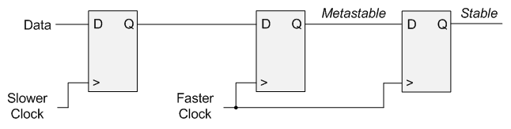
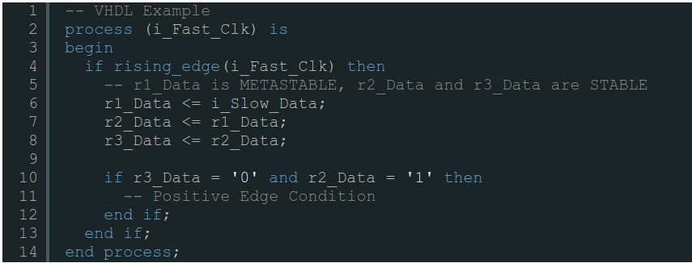
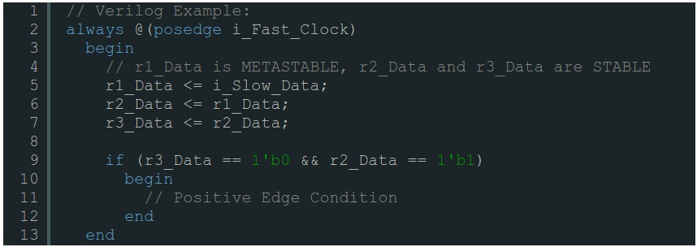
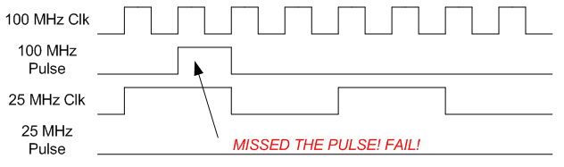
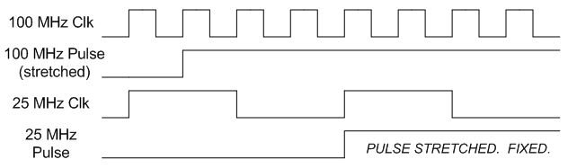
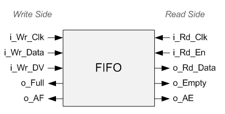

.. _ClockDomains:

######################
Crossing Clock Domains
######################

Crossing clock domains inside of an FPGA is a common task, but it is one that many digital designers have trouble with.
Problems can occur if the digital designer does not understand all of the details involved in crossing from one clock
domain into another. A single clock domain entails all of the :ref:`Flip-Flops <FF>` that are driven by one clock. In
this article, the first two sections describe how to pass individual signals from one clock domain to another. The 
last section goes into detail about how to use a FIFO to send large amounts of data between two clock domains. Using a 
FIFO is by far the most common and reliable method.

=========================================================
Crossing from slower clock domain to faster clock domain
=========================================================

The simplest type of crossing is going from one clock domain to a faster clock domain. In this type of crossing, you 
are still subject to :ref:`Metastability <Meta>`, but the fix described in that article works very well in this
situation. All you need to do is "double-flop" the data, which is shown in the figure below.

    Crossing from a slow to fast clock domain.
    
The slower clock is your source clock domain. The faster clock is your destination clock domain. In the faster clock
domain, the first :ref:`Flip-Flops <FF>` has a metastable output. The reason this occurs is that when performing this
crossing, there will be violations of setup and hold time which are the cause of metastability. We can work around
this by simply re-registering or double-flopping the data on in the faster clock domain as shown in the figure above.
The output of the second Flip-Flop will be stable and now the data can be used in the faster clock domain.

--------------------------------------------
Detecting edges when crossing clock domains
--------------------------------------------

The code below shows how you might look for a rising edge on a signal when crossing from a slow to a fast clock 
domain. Note that your logic for the edge-detection must be done in the fast clock domain.

    
    VHDL Example

    Verilog Example
    
=========================================================    
Crossing from faster clock domain to slower clock domain
=========================================================    

This situation is slightly more complicated than the previous one. Here we are going from a fast clock domain to one
that is slower. In this situation, it is easy to imagine an example where the data inside the fast clock domain might
change before the slow clock domain even sees it. For example, consider a pulse that occurs for 1 clock cycle in a
100 MHz clock domain, that you are trying to sample in a 25 MHz clock domain. There is a good chance that you will
never see this pulse if you simply sample the data with your 25 MHz clock! **In order to transfer a signal from a fast
clock domain to a slow clock domain you must stretch out your signal.** Refer to the figures below for a visual
representation of this.

    100 MHz Pulse is not stretched. 25 MHz pulse never triggers.

    100 MHz Pulse is stretched. 25 MHz pulse will now trigger.

Stretching your data occurs when you stretch out a pulse or data long enough to guarantee that the slow clock domain
has a chance to sample it. In the example above, you would need to stretch out your data to ensure that setup and hold
times are met no matter when the data is sampled. To properly guarantee that setup and hold times are met, I recommend
stretching out your pulses such that they take at least 2 clock cycles in the slow clock domain. So in the example
above, you should stretch out the 100 MHz pulse to at least 8 clock cycles (you can always go more).

=========================================================
Crossing between clock domains with lots of data. (FIFO)
=========================================================

This is the most common way to send data between two clock domains is to use a :ref:`FIFO <Fifo>`. The one requirement
here is that you need to make sure that the FIFO you use supports two different clock frequencies. Some FIFOs only
support one clock. When crossing from one clock domain to another, you must ensure that the two cardinal rules of
FIFOs are maintained:

1. Never Write to a Full FIFO
2. Never Read from an Empty FIFO

As long as those two rules are maintained you will be fine. Since your clock domains are different, you need to keep
in mind the level of the words in your FIFO. This is often done best using the Almost Full (AF) and Almost Empty (AE)
FIFO Flags. So think about your situation and make sure that both the read and the write sides of your FIFO will be
okay.

    Signals of FIFO when Crossing Clock Domains.

Many FIFOs offer you a count of the words inside the FIFO, but I do not recommend ever using this. Additionally, if
you write your code correctly, you shouldn't need to rely on the Empty or Full flags either, just the AE/AF flags.

Let's consider a case where we have some module writing data to a FIFO at 33 MHz. On the read side, we are dumping the
data as quickly as possible to external memory. Let's say the read clock is 110 MHz. In this situation, we can see
that the read clock is much faster than the write clock, so even if the writes were happening at ever clock cycle, the
read side will still be idle much of the time. The way to handle this is to set your Almost Empty flag to some number
that indicates to your read code that there is a burst of data ready for the read module. Let's assume this gets set
to 50 words. Once the FIFO has 50 words inside of it, the AE flag will transition from 1 to 0, which will trigger some
logic to drain exactly 50 words from the FIFO. This is often how crossing clock domains gets implemented. If you are
using your AE/AF flags, you're doing it correctly. Try not to rely on your Empty or Full flag.

=========================================
Timing Errors and Crossing Clock Domains
=========================================

Commonly when you cross clock domains you will experience timing errors. This is normal! This is the tools telling you
that you will have a situation where your setup and hold times are not going to hold, and that you will have a
metastable condition. As I described earlier, metastability is common for this work, so as long as you understand it
and can design around it you will be fine. You should look up how to create timing constraints that relax the tools
and tell them that you're a competent designer and that you understand that your design can be metastable. You should
always aim to have no timing errors in your design. Exactly how to create these timing constraints is beyond the scope
of this article. Refer to your FPGA vendor user guides for details of this. Here is a reference for 
`Xilinx <https://www.xilinx.com/itp/xilinx10/books/docs/timing_constraints_ug/timing_constraints_ug.pdf>`_ and for
`Altera <http://www.alterawiki.com/wiki/Timing_Constraints>`_. 

In summary, as an FPGA designer you will experience situations where you cross clock domains. You need to clearly 
understand the common pitfalls that occur in these situations. If the crossing is simple enough, you can just
double-flop the data or perform pulse stretching. For the majority of situations, you'll likely need to use a FIFO
that supports two clocks, one for reading and one for writing. When structuring your cross-clock domain code, be very
careful not to mix and match signals from both clock domains.
