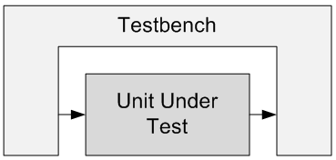

.. _Bench:

#########
Testbench
#########

Testbenches are pieces of code that are used during FPGA or ASIC simulation. **Simulation is a critical step when
designing your code.** Simulation allows you the ability to look at your FPGA or ASIC design and ensure that it does
what you expect it to. A testbench provides the stimulus that drives the simulation.

Some :ref:`digital <Digital>` designers might feel that a testbench is not required, but I disagree. You should
always (especially as a beginner) be simulating your designs to make sure they work correctly before you synthesize 
them and program your FPGA. And if you're building an ASIC, you most likely have a team of verification engineers that
are hard at work writing many testbenches. The reason for this is that it is much easier to find your bugs in
simulation than it is on the real hardware.

A simple testbench will instantiate the Unit Under Test (UUT) and drive the inputs. You should attempt to create all
possible input conditions to check every corner case of your project. A good testbench should be self-checking. A
self-checking testbench is one that can generate inputs and automatically compare actual outputs to expected outputs.
Most of the examples on this website just have simple testbenches to show how the design works.

    A Testbench and a Unit Under Test
    
The above figure shows a block diagram of a simple testbench. The testbench wraps up the UUT, provides it inputs, and
checks its outputs. Writing good testbenches is fundamentally important to designing good FPGA code. When planning
your project, don't forget to plan to create your testbench simulations.
