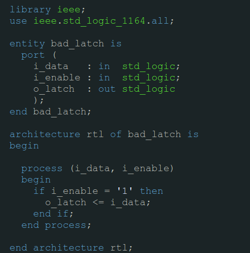
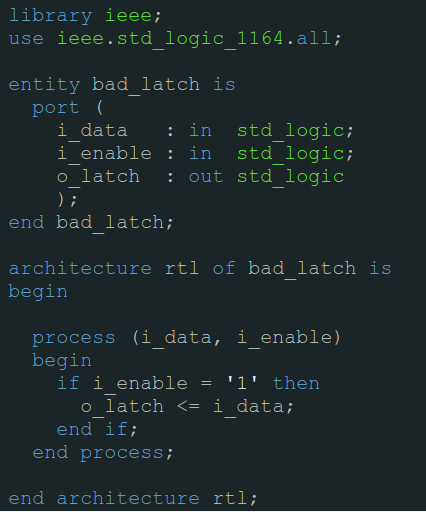
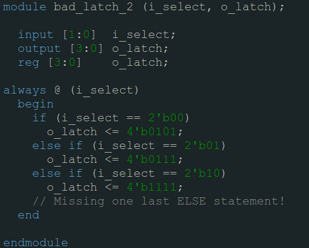

.. _AvoidLatches:

#############################
How to avoid creating Latches
#############################

Lets start by statign why latches should not be used:

1. Often the user who created the latch did so unintentionally. It is highly likely that the HDL code written is not 
   actually what the designer intended.
   
#. They can be very difficult for the FPGA tools to create properly. Often they add significant routing delays and can
   cause your design to fail to meet timing.

So firstly, let's ask the question: How are latches created? 
**Latches are created when you create a combinational process or conditional assignment (in VHDL) or a combinational
always block (in Verilog) with an output that is not assigned under all possible input conditions.** This creates what
is known as incomplete assignment by the synthesis tools. The assignment of the output is not complete under all input
possibilities. This is bad and should be avoided! Let's look at some VHDL example code to see how a latch is created.

Latch Creation via Incomplete Assignment in Combinational Process:

Do you see the problem in the code above? What happens when i_enable is 0? This is undefined! The tools assume that 
when i_enable is 0, the value on o_latch should not change. Since this is combinational logic (no clock is being used)
this infers a latch. Let's look at one more VHDL example that creates a latch.

Latch Creation via Incomplete Assignment in Conditional Assignment:

In this case not  all possible input combinations of i_select are specified. What happens to o_latch when 
i_select = "11"? This creates an incomplete assignment and therefore creates a latch. A latch is almost certainly not
what the Digital Designer intended to create with this code. To fix the code above, the Digital Designer can either
specify what happens when i_select = "11" or can use the else clause with no when attached to it. I recommend the
latter because it is more flexible. If the width of i_select changes from two bits to three bits your code will still
not create a latch. Let's look at one more example in Verilog:

Latch Creation via Incomplete Assignment in Combinational Always Block:

This code above will generate a latch, because the output o_latch is not defined when the input i_select is equal to
2'b11. To avoid this, make sure that all of your if statements that are used in combinational always blocks always 
have one last else statement to catch all missing conditions! Another place where a latch could be generated in
Verilog is in a case statement that does not include the default assignment. If not all possible cases are accounted 
for and the case is in a combinational always block then the synthesis tools will infer a latch. Notice that I am
emphasizing that this is only a problem when generating combinational logic. When you have registered logic 
(in a sequential process in VHDL or in a sequential always block in Verilog) you will never generate a latch.
