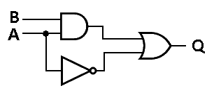
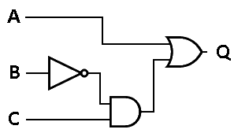

.. _Lut:

###################
Look-Up Table (LUT)
###################

**L**\ook-**U**\p **T**\ables (LUT) enables us to make more complicated Boolean algebra equations.

First it should be noted that all of those discrete logic gates that are described in the 
:ref:`Logic Gate <LogicGates>` paragraph, actually do not physically exist inside of an FPGA! However it is possible
to perform those functions. The way that FPGAs are able to do Boolean algebra is by using LUTs. A LUT is a discrete
block of functionality that can be programmed by the Digital Designer. LUTs use the same truth table concept to relate 
outputs to inputs. Let's try an example.

Create a truth table for the following Boolean equation: Q = A*B + A'. Meaning of the symbols is:

  * \ * = AND
  * \ + = OR
  * \ ' = NOT
  * \ ^ = XOR

So verbally, the Boolean Equation Q = A*B + A' can be read, "The output Q gets A and B or not A". Let's look at the 
truth table and the circuit created by this equation. As it can be seen from the image below, it takes three total 
gates to make this circuit.

    Boolean Algebra Equation made with Logic Gates.

+------------------------------+
| Truth Table - A*B + A'       |
+---------+---------+----------+
| Input A | Input B | Output Q |
+---------+---------+----------+
| 0       | 0       | 1        |
+---------+---------+----------+
| 0       | 1       | 1        |
+---------+---------+----------+
| 1       | 0       | 0        |
+---------+---------+----------+
| 1       | 1       | 1        |
+---------+---------+----------+

The truth table in the above example has two inputs (A and B), which means that there are four possible output 
possibilities. Each input increases the number of possible outputs by a factor of 2. So for one input there are 2 
output possibilities, for 2 inputs there are 4 output possibilities, for 3 inputs 8 output possibilities, etc. 
Mathematically this can be represented by 2^(# of inputs). Let's now look at one more example with three inputs. Here 
is the equation we are going to create a truth table for: Q = A + (C*B'). Note that the parenthesis indicate that the
operation C AND NOT B occurs prior to the OR operation.

    
    Boolean Algebra Equation 3-input made with Logic Gates.

+----------------------------------------+
| Truth Table - A + (C*B')               |
+---------+---------+---------+----------+
| Input A | Input B | Input C | Output Q |
+---------+---------+---------+----------+
| 0       | 0       | 0       | 0        |
+---------+---------+---------+----------+
| 0       | 0       | 1       | 1        |
+---------+---------+---------+----------+
| 0       | 1       | 0       | 0        |
+---------+---------+---------+----------+
| 0       | 1       | 1       | 0        |
+---------+---------+---------+----------+
| 1       | 0       | 0       | 1        |
+---------+---------+---------+----------+
| 1       | 0       | 1       | 1        |
+---------+---------+---------+----------+
| 1       | 1       | 0       | 1        |
+---------+---------+---------+----------+
| 1       | 1       | 1       | 1        |
+---------+---------+---------+----------+

    
    3-Input Look-Up Table

As was mentioned above, discrete logic gates do not actually exist inside of an FPGA. Instead FPGAs uses LUTs. A LUT
is programmed by the Digital Designer to perform a Boolean algebra equation like the two that we saw above. One
3-Input LUT can make any Boolean algebra equation you can think of using 3 input signals.

LUTs can come in different sizes depending on the FPGA that you are using, but they all behave the same way. 3-Input 
LUTs were the norm not too long ago, but today 5-Input and even 6-Input LUTs are common. If you need to make a more 
complicated expression, you can just use more LUTs. LUTs are one of the two most fundamental components in an FPGA. 
A single FPGA has thousands of these components.
