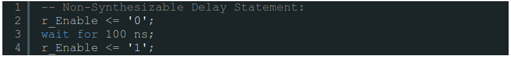
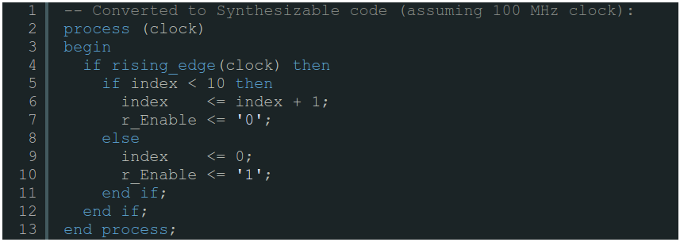

########################################
Synthesizable vs. Non-Synthesizable Code
########################################

When you write you Verilog or VHDL code, you are writing code that will be translated into gates, registers, RAMs, etc.
The program that performs this task is known as a Synthesis Tool. It is the job of the Synthesis Tool to take your 
Verilog or VHDL code and turn it into something that the FPGA can understand. However, there are some parts of Verilog
and VHDL that the FPGA simply cannot implement. When you write code like this, it is called non-synthesizable code.

So why would you have a language that contains code that is non-synthesizable? The reason is that it makes your 
:ref:`testbenches <Bench>` more powerful. When you write a testbench for simulation, often using non-synthesizable 
code constructs makes your testbench better and allows you to accomplish things easier.

=================
Delay Statements
=================

The most fundamental non-synthesizable piece of code is a delay statement. **The FPGA has no concept of time, so it is 
impossible to tell the FPGA to wait for 10 nanoseconds.** Instead, you need to use clocks and :ref:`flip-flops <FF>` 
to accomplish your goals. Below is an example of non-synthesizable code that has been converted to code that can be 
synthesized by the tools.

    
    Non-Synthesizable Delay Statement:

    Converted to Synthesizable code (assuming 100 MHz clock):

===================
Looping Statements
===================

Another piece of code that new digital designers often misuse is looping statements, such as **while**, **for**,
**repeat**, etc. Loops in synthesizable code cannot actually be used the same way that you might see them in a 
software language like C. This is a huge problem that new hardware developers have. They have seen for loops hundreds
of times in C, so they think that they are the same in Verilog and VHDL.

.. note::

    Loops do NOT behave the same way in hardware as in software. Until you understand how looping statements work you 
    should not use them.

.. note::

    Knowing the difference between synthesizable and non-synthesizable code is very important to being a good digital 
    designer. Only use constructs that can be synthesized when writing code that will run on an FPGA.
    
