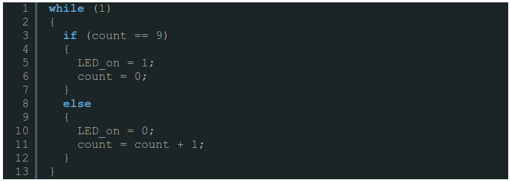
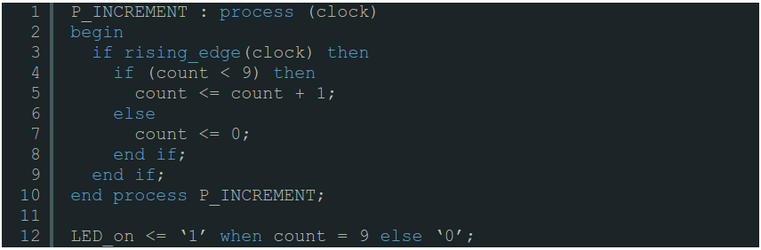
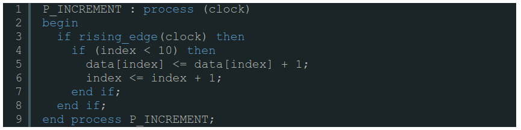
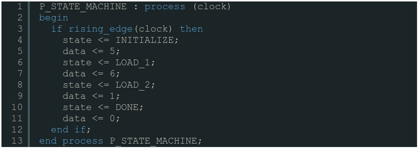
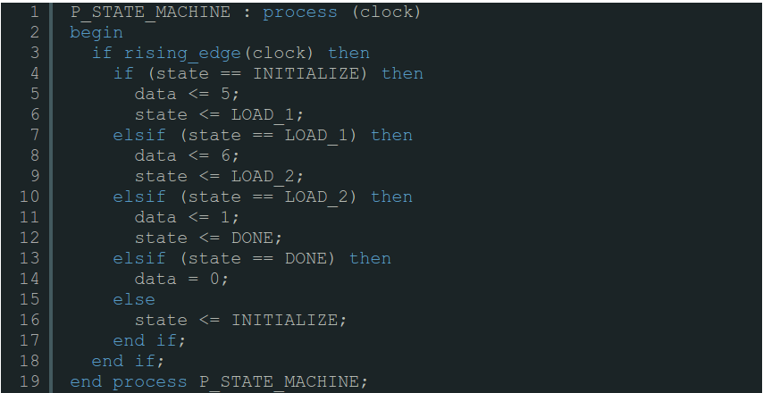

########################################################################
What every software programmer needs to understand about hardware design
########################################################################

Every software developer who knows a language such as C or Java has the same problems when trying to start programming
in VHDL or Verilog. They make assumptions about how code works. These assumptions are usually universal for all 
software languages. Unfortunately, those assumptions do not hold for hardware description languages. If you are new to 
hardware development but know a software language or two, read this first! 

=========================================
Assumption #1: Serial vs. Parallel Logic
=========================================

This is probably the most fundamental difference between hardware and software programming languages. Software 
designers have only ever seen serial code, yet they probably do not realize this fact. What is meant by serial code is
that the lines of code are executed one at a time. For example, Line #2 can only execute after Line #1 is complete. 
VHDL and Verilog do not behave this way! They are known as parallel logic languages and all of the lines of code can 
and will execute all at the same time. This is known as concurrency. Here is an example demonstrating the difference 
between serial and parallel logic. Let’s say that a designer wants to light up an LED once every ten clocks.

    
    Example Software Code.
    

    
    Equivalent VHDL Code.
    
The important thing to realize here is that in the software code, each line executes, then the next line is allowed to
execute. This is **NOT** true in VHDL and Verilog, and this is demonstrated by the last line that assigns the LED_on 
signal. That line is running concurrently with the VHDL process. It is always assigning either a ‘1’ or a ‘0’ to 
LED_on. If this were software, this line would only be reached once the preceding lines of code had been executed. A
good digital designer needs to always remember that VHDL and Verilog are parallel languages.   
 
==========================
 Assumption #2: For Loops 
==========================

This is a huge problem that new hardware developers have. They have seen for loops hundreds of times in C, so they
think that they are the same in Verilog and VHDL.
For loops do **NOT** behave the same way in hardware as in software. Until you understand how for loops work, you
should not use them.

    Example Software Code.
    
This code will take every value in the array “data” and increment it by 1.

    
    Equivalent VHDL Code.
    
Starting to see a pattern here? Code written in C is almost always going to be less lines to do similar functionality
as code in VHDL or Verilog. I’m going to be bold and say this: if you haven’t done at least 3 FPGA designs you should
never be using for loops. So think about how the code you wrote in software could be rewritten to never use a for loop.
Usually all you need is to add a counter signal (like index in the example above) to do the same thing that the for
loop will do.

==============================================
Assumption #3: Execution of Code is Immediate
==============================================

This ties in to the serial vs. parallel logic discussion above but it is a common mistake that software developers
often make. Software developers need to remember that a line of code is not immediately executed, with the value of
the signal updated for use. An example below details this assumption with a state machine. The example below shows an 
initialization routine for some peripheral component, say an Analog to Digital converter. The FPGA needs to write in 
order to the ADC: 5, 6, 1, 0 on the data line. The state machine as described in software will allow the value of data
to change as the states change. Unfortunately in the broken example of hardware code below this is not the case:    

.. figure:: c-example2.png
    
    Example Software Code.
    

    
    NOT Equivalent Hardware Code: (Broken Code)

The hardware representation of this code is very broken! Since every line in a process executes concurrently, data 
will be always stuck at 0 and state will always be stuck at DONE. This code will never execute the state machine the
way that it will in the software code. The code below is the correct way to write this state machine in VHDL:

    
    Equivalent VHDL Code.

The three examples above are three places that new software developers often have a hard time with when starting a new
design in VHDL or Verilog. The three assumptions above should always be in the mind of a new digital designer. 
Questions about concurrency, for loops, and execution of code should always be considered. 
