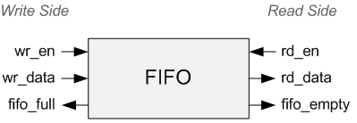

.. _Fifo:

####
FIFO
####

.. TODO: RTL example

The acronym FIFO stands for **F**\irst **I**\n **F**\irst **O**\ut. FIFOs are used everywhere in FPGA and ASIC designs,
they are one of the basic building blocks. And they are very handy! FIFOs can be used for any of these purposes:

- :ref:`Crossing clock domains <ClockDomains>`
- Buffering data before sending it off chip (e.g. to DRAM or SRAM)
- Buffering data for software to look at at some later time
- Storing data for later processing

A FIFO can be thought of a one-way tunnel that cars can drive through. At the end of the tunnel is a toll with a gate.
Once the gate opens, the car can leave the tunnel. If that gate never opens and more cars keep entering the tunnel, 
eventually the tunnel will fill up with cars. This is called FIFO Overflow and in general it's not a good thing. How
deep the FIFO is can be thought of as the length of the tunnel. The deeper the FIFO, the more data can fit into it
before it overflows. FIFOs also have a width, which represents the width of the data (in number of bits) that enters
the FIFO. Below is an image of the basic interface of any FIFO. These signals will always be found when you look at
any FIFO. Often there are more signals that add additional features, such as a count of the number of words in the
FIFO. See the figure below:

    
    Basic Interface Signals of a FIFO
    
The FIFO can be divided up into the write half and the read half. The write half has the signals Write Enable, Write
Data, and FIFO Full. The designer should **never write to a full FIFO**\! Always check the FIFO Full flag to make sure
there's room to write another piece of data, otherwise you will lose that data.

The read half has the signals Read Enable, Read Data, and FIFO Empty. The designer should **never read from an empty
FIFO**\! As long as you obey these two basic rules you and FIFOs will get along nicely.

The two rules of FIFOs:

- Never write to a full FIFO (overflow)
- Never read from an empty FIFO (underflow)

FIFOs themselves can be made up of dedicated pieces of logic inside your FPGA or ASIC or they can be created from
Flip-Flops (distributed registers). Which one of these two the synthesis tools will use is entirely dependent on the 
FPGA vendor that you are using and how you structure your code. Just know that when you use the dedicated pieces of 
logic they have better performance than having a register-based FIFO.
